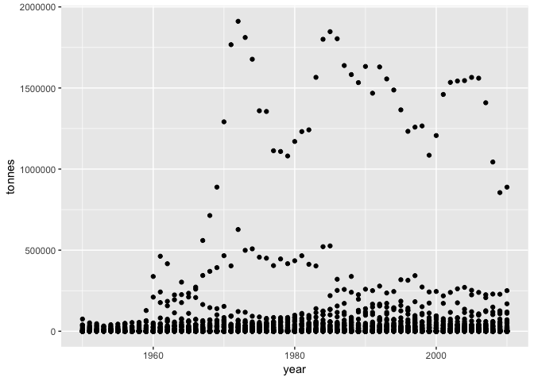
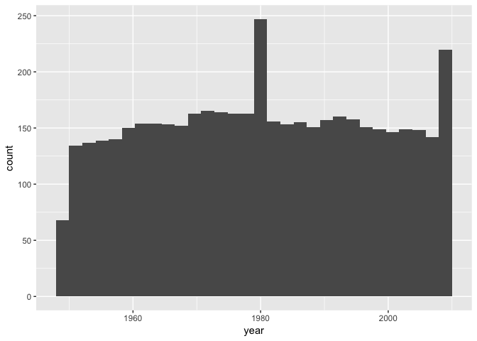
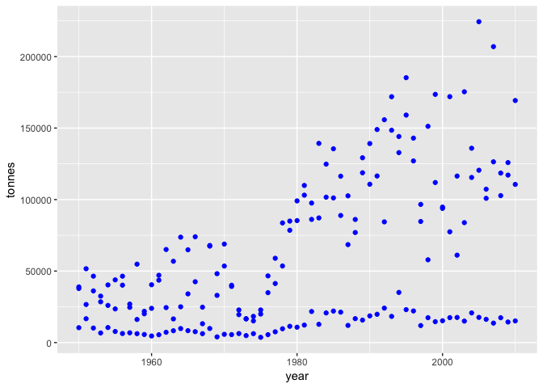
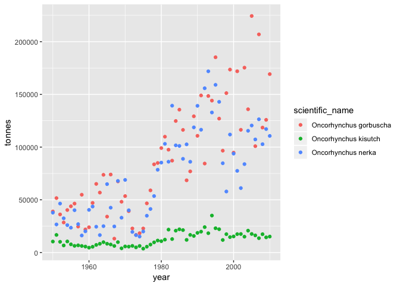
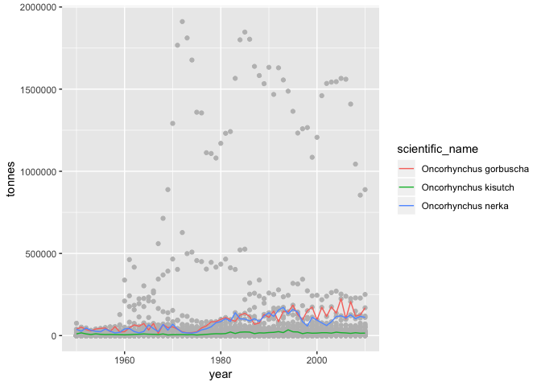
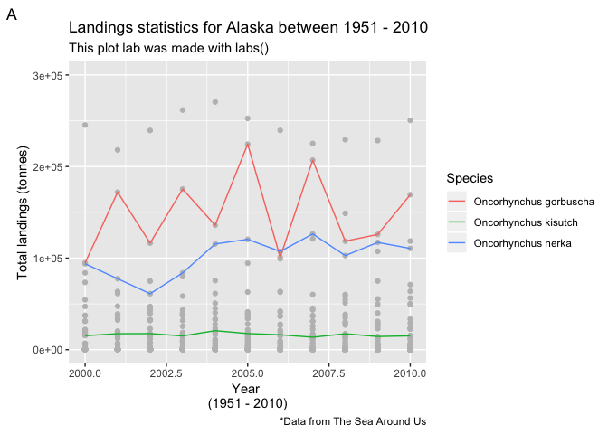
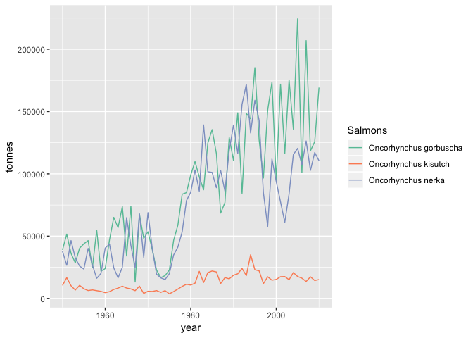

# Libraries and data


```r
# Library ####

# Function to load multiple packages, it will install them if you don't have it already
ipak <- function(pkg){
  new.pkg <- pkg[!(pkg %in% installed.packages()[, "Package"])]
  if (length(new.pkg)) 
    install.packages(new.pkg, dependencies = TRUE,repos = "http://cran.us.r-project.org")
  sapply(pkg, require, character.only = TRUE)
}


#### Library needed for this session ####
packages <- c(
  "dplyr", # Data manipulation
  "tidyr", # Data manipulation
  "ggplot2", #Nice grpahs and spatial analysis
  "rgdal",
  "RColorBrewer", # for plot colors
  "ggrepel",
  "gridExtra" # For edditing plot grids
)

ipak(packages)
```

```
## Loading required package: dplyr
```

```
## 
## Attaching package: 'dplyr'
```

```
## The following objects are masked from 'package:stats':
## 
##     filter, lag
```

```
## The following objects are masked from 'package:base':
## 
##     intersect, setdiff, setequal, union
```

```
## Loading required package: tidyr
```

```
## Loading required package: ggplot2
```

```
## Loading required package: rgdal
```

```
## Loading required package: sp
```

```
## rgdal: version: 1.3-6, (SVN revision 773)
##  Geospatial Data Abstraction Library extensions to R successfully loaded
##  Loaded GDAL runtime: GDAL 2.1.3, released 2017/20/01
##  Path to GDAL shared files: /Library/Frameworks/R.framework/Versions/3.5/Resources/library/rgdal/gdal
##  GDAL binary built with GEOS: FALSE 
##  Loaded PROJ.4 runtime: Rel. 4.9.3, 15 August 2016, [PJ_VERSION: 493]
##  Path to PROJ.4 shared files: /Library/Frameworks/R.framework/Versions/3.5/Resources/library/rgdal/proj
##  Linking to sp version: 1.3-1
```

```
## Loading required package: RColorBrewer
```

```
## Loading required package: ggrepel
```

```
## Loading required package: gridExtra
```

```
## 
## Attaching package: 'gridExtra'
```

```
## The following object is masked from 'package:dplyr':
## 
##     combine
```

```r
##________________________________________________##

# Data ####

# Load Sea Around Us catch data for Alaska
SAU_Alaska <- read.csv("~/GitHub/studyGroup/lessons/Lessons_Data/SAU_Alaska.csv")

Clean_Data <- SAU_Alaska %>% 
  group_by(year,area_name,scientific_name) %>% 
  summarise_if(is.numeric,sum,na.rm=T)
```


# The basic ggplot2 structure

Ok, `ggplot2`follows a very simple structure made by to main components: 

- the aesthetics you want to plot (`aes()`);
- the geometric form you want to represent (i.e. `geom_point()`).

So any basic plot will have to have, at least, these two components, however, there are several ways to create that first plot. Note, in the example below, that ggplot2 uses the "+" sign to add components to the plot 


```r
# The basic structure
ggplot(data = Clean_Data, # tell ggplot your data source
       aes(x = year, # Note that the aesthetics set your x and y axis
           y = tonnes)
       ) + # ggplot "adds"" components 
  geom_point() # finally, included the geometrics (points in this case)
```

<!-- -->

```r
# Alternative way.
# I prefere this version because it allows to clearly see each layer you include to the plot

ggplot(data = Clean_Data) + # call ggplot with your data
  geom_point(
    aes(x = year, # Note that the aesthetics set your x and y variables
        y = tonnes)
    )  # ggplot "adds"" components 
```

<!-- -->

```r
# And it can be as simple as...

ggplot(Clean_Data) + aes(year,tonnes) + geom_point()
```

<!-- -->

## Geometrics 

Ggplot2 offeres a laaaaaaarge variety of geometrics forms. From points, to lines, to maps to words, I keep finding new things to plot with `ggplot2`. Here are some of the basic geometrics, check out the [official webpage](https://ggplot2.tidyverse.org/reference/index.html#section-layer-geoms) for a more complete list:

- `geom_point`(); scatter plots
- `geom_line`(); Line plots
- `geom_histogram`(); historams, *note that these only need x*
- `geom_bar`(); Bar plots, this one is a little tricky, normally needs a "stat" component
- `geom_boxplot`(); Boxplots

One of the beauties of `ggplot2` is that most of these (and the others) geometrics use the same structure so you can easilly change from one to another, according on your preference.


```r
# You can change between geometrics by simply commenting of the undesired one! 

ggplot(data = Clean_Data) + # call ggplot with your data
  geom_point(
    # geom_line(
    aes(x = year, 
        y = tonnes)
    )
```

<!-- -->

```r
# Some of them only use x
ggplot(data = Clean_Data) + # call ggplot with your data
  geom_histogram(
    # geom_bar(
    aes(x = year)
    )
```

```
## `stat_bin()` using `bins = 30`. Pick better value with `binwidth`.
```

<!-- -->


## Add some colors

`ggplot2`gives you the option to color all your vaiables or to color them by some third variable. Note that, when you want all of your points in one same color you have to call `color` (or `colour`, `ggplot2`does not discriminate!) outside the aesthetics (`aes()`). Alternativeley, if you want to, say, set a color by species, this has to be within the `aes()`


```r
# Data for example

Example_Data <- Clean_Data %>% 
  filter(scientific_name %in% c("Oncorhynchus kisutch","Oncorhynchus nerka","Oncorhynchus gorbuscha"))

# ________________ #

# All points in one color
ggplot(data = Example_Data) + 
  geom_point(
    aes(x = year, 
        y = tonnes), # Note that we closed aes here!
    # colour = "red", # R is inclusive! 
    color = "blue"
    )  
```

<!-- -->

```r
# Set color by species
ggplot(data = Example_Data) + 
  geom_point(
    aes(x = year, 
        y = tonnes,
        color = scientific_name
        ) # Note that we closed aes here!
    )
```

<!-- -->

## Adding components

Now, the way `ggplot2` works is that you can keep adding components to your initial plot, lets see how this works by first naming our previus plot:


```r
# Base plot
P_One <- ggplot(data = Clean_Data) + # call ggplot with your data
  geom_point(
    aes(x = year, # Note that the aesthetics set your x and y variables
        y = tonnes),
    colour = "grey"
    )

# Now if I call "P_One" I will ahve my plot
# P_One

## Now lets say we want to hilight the previous species in this plot...

P_One + 
  geom_line( data = Example_Data,
    aes(x = year, 
        y = tonnes,
        color = scientific_name
        ) # Note that we closed aes here!
    )
```

<!-- -->

```r
# You can also re-name your new plot

P_Two <- P_One + 
  geom_line( data = Example_Data,
    aes(x = year, 
        y = tonnes,
        color = scientific_name
        ) # Note that we closed aes here!
    )

# Call me! 
# P_Two
```

# Making your plot look B-E-A-utiful! 

## Axis

You can change, modify and eddit all your scales from the actual number to the title of the axis. There are several ways that you can work out your plot eddits, I use the `labs()` function, I think is more complet, but you have other alernatives. The `labs()`function has many options like:

 - Title and subtitle
- x and y axis titles
- Legend title
- Figure caption
- Figure tag; (i.e. Plot A and Plot B)

* Note: to exclud a label you can set it to NULL (i.e. `labs(x = NULL)`) or to blank (i.e. `labs(x = "")`)


We can also change the scales of our plot using `lims()`, `xlim()`, or/and `ylim()`.

* Note: when you limit your scales ggplot2 will give you a warning message that your plot is missing values, something like: `Removed 3908 rows containing missing values (geom_point).`


```
## Warning: Removed 3847 rows containing missing values (geom_point).
```

```
## Warning: Removed 150 rows containing missing values (geom_path).
```

<!-- -->


## The "scales" family

There are over 50 functions that control different aspects of your scales and plot looks like the color of categories, titles, shapes, limits, steps, transparency, etc. The scale family can be used in many (all?) aestetics, just match the aestetic with the scale you want:

- `scale_fill_`, if you used `aes(fill = Variable)`
- `scale_color_`, if you used `aes(color = Variable)`
- `scale_alpha_`
- `scale_x_`
- `scale_y_`
A complete list can be found in the [Official Website](https://ggplot2.tidyverse.org/reference/index.html#section-scales). In addition, `scale_colour_brewer()`, provides a great set of pallets.
- 


```
## Scale for 'colour' is already present. Adding another scale for
## 'colour', which will replace the existing scale.
```

<!-- -->


# From me to you


